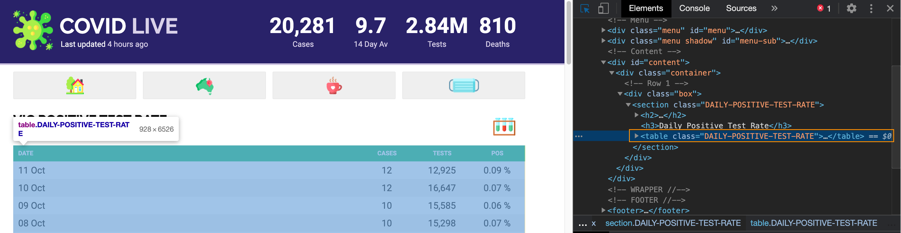
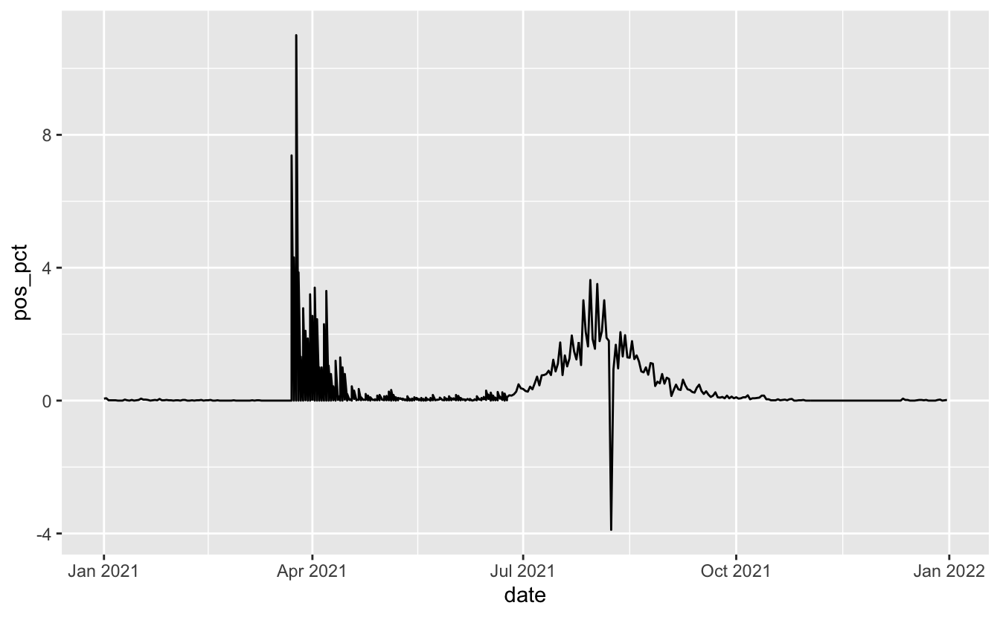
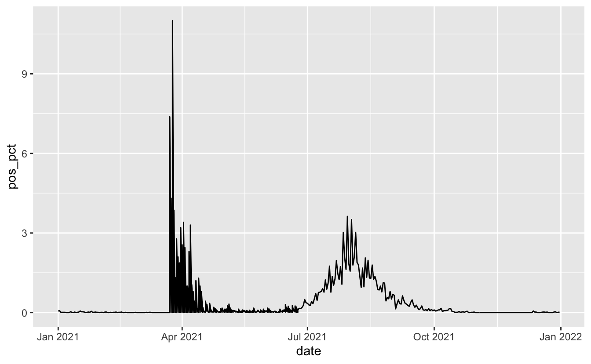
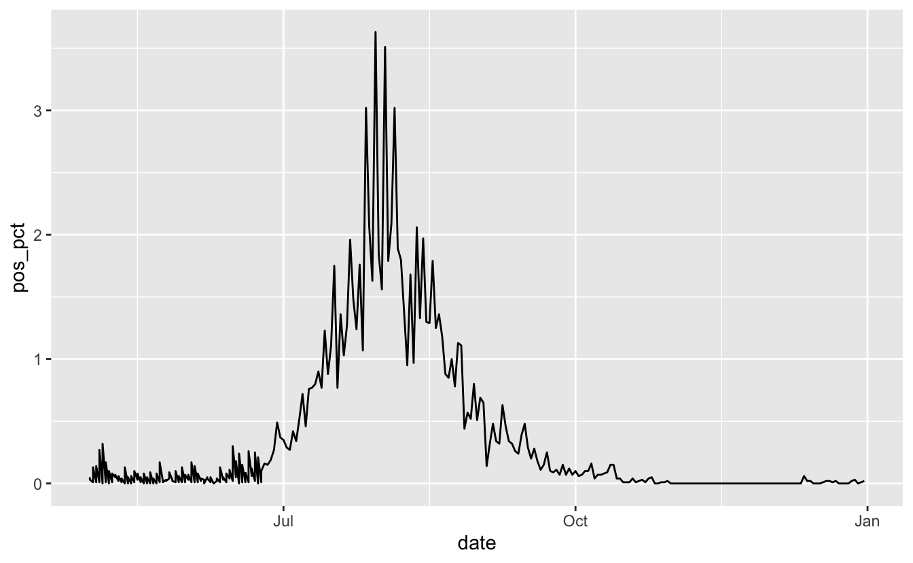
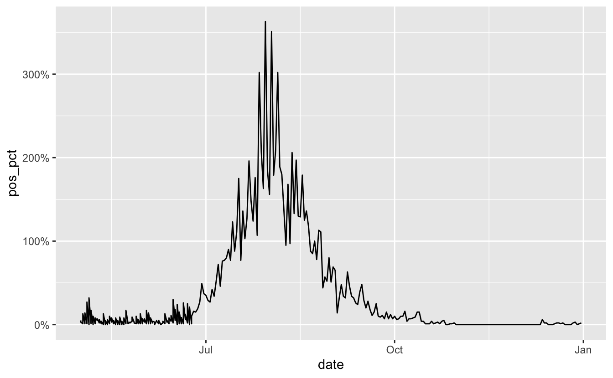

# NB 

This is an example of setting up a targets workflow using:

- targets
- tflow
- fnmate
- capsule


# Introduction 

Ah, COVID19. Yet another COVID19 blog post? Kinda? Not really? This blog post covers how to:

- Scrape nicely formatted tables from a website with [`polite`](https://dmi3kno.github.io/polite/), [`rvest`](https://rvest.tidyverse.org/) and the [`tidyverse`](https://tidyverse.org/)
- Format dates with `strptime`
- Filter out dates using [`tsibble`](https://tsibble.tidyverts.org/)
- Use nicely formatted percentages in [`ggplot2`](https://ggplot2.tidyverse.org/) with [`scales`](https://scales.r-lib.org/).

We're in lockdown here in Melbourne and I find myself looking at all the case numbers every day. A number that I've been paying attention to helps is the positive test rate - the number of positive tests divided by the number of total tests. 

There's a great website, [covidlive.com.au](https://covidlive.com.au/), posted on [covidliveau](https://twitter.com/covidliveau), maintained by [Anthony Macali ](https://twitter.com/migga)

We're going to look at the [daily positive test rates for Victoria](https://covidlive.com.au/report/daily-positive-test-rate/vic), first let's load up the three packages we'll need, the `tidyverse` for general data manipulation and plotting and friends, `rvest` for web scraping, and `polite` for ethically managing the webscraping.


```r
library(tidyverse)
#> ── Attaching packages ───────────────────────────── tidyverse 1.3.1 ──
#> ✓ ggplot2 3.3.4     ✓ purrr   0.3.4
#> ✓ tibble  3.1.2     ✓ dplyr   1.0.6
#> ✓ tidyr   1.1.3     ✓ stringr 1.4.0
#> ✓ readr   1.4.0     ✓ forcats 0.5.1
#> ── Conflicts ──────────────────────────────── tidyverse_conflicts() ──
#> x dplyr::filter() masks stats::filter()
#> x dplyr::lag()    masks stats::lag()
library(rvest)
#> 
#> Attaching package: 'rvest'
#> The following object is masked from 'package:readr':
#> 
#>     guess_encoding
library(polite)
conflicted::conflict_prefer("pluck", "purrr")
#> [conflicted] Will prefer purrr::pluck over any other package
conflicted::conflict_prefer("filter", "dplyr")
#> [conflicted] Will prefer dplyr::filter over any other package
```

(Note that I'm saying to prefer `pluck` from `purrr`, since there is a namespace conflict). 

First we define the web address into `vic_test_url` and use `polite`'s `bow` function to check we are allowed to scrape the data:


```r
vic_test_url <- "https://covidlive.com.au/report/daily-positive-test-rate/vic"

bow(vic_test_url) 
#> <polite session> https://covidlive.com.au/report/daily-positive-test-rate/vic
#>     User-agent: polite R package - https://github.com/dmi3kno/polite
#>     robots.txt: 2 rules are defined for 2 bots
#>    Crawl delay: 5 sec
#>   The path is scrapable for this user-agent
```

OK, looks like we're all set to go, let's `scrape` the data. This is another function from `polite` that follows the rule set from `bow` - making sure here to obey the crawl delay, and only to scrape if `bow` allows it. 


```r
bow(vic_test_url) %>% 
  scrape() 
#> {html_document}
#> <html xmlns="http://www.w3.org/1999/xhtml" xml:lang="en" lang="en">
#> [1] <head>\n<!-- Title --><title>Daily Positive Test Rate in Victoria - COVID ...
#> [2] <body id="page-report" class="page-state-vic">\n<div class="wrapper">\n\n ...
```

A shout out to [Dmytro Perepolkin](https://github.com/dmi3kno), the creator of `polite`, such a lovely package.

This gives us this HTML document. Looking at the website, I'm fairly sure it is a nice HTML table, and we can confirm this using developer tools in Chrome (or your browser of choice)



There are many ways to extract the right part of the site, but I like to just try getting the HTML table out using `html_table()`. We're going to look at the output using `str()`, which provides a summary of the **str**ucture of the data to save ourselves printing all the HTML tables


```r
bow(vic_test_url) %>% 
  scrape() %>% 
  html_table() %>% 
  str()
#> List of 2
#>  $ : tibble [2 × 4] (S3: tbl_df/tbl/data.frame)
#>   ..$ X1: chr [1:2] "COVID LIVE" "Last updated 1 hour ago"
#>   ..$ X2: chr [1:2] "33.3%" "1st Dose"
#>   ..$ X3: chr [1:2] "5.0%" "2nd Dose"
#>   ..$ X4: chr [1:2] "52" "Active"
#>  $ : tibble [459 × 4] (S3: tbl_df/tbl/data.frame)
#>   ..$ DATE : chr [1:459] "24 Jun 21" "23 Jun 21" "22 Jun 21" "21 Jun 21" ...
#>   ..$ CASES: int [1:459] 3 1 2 9 2 3 2 1 8 3 ...
#>   ..$ TESTS: chr [1:459] "22,812" "28,967" "12,476" "16,290" ...
#>   ..$ POS  : chr [1:459] "0.01 %" "0.00 %" "0.02 %" "0.06 %" ...
```

This tells us we want the second list element, which is the data frame, and then make that a `tibble` for nice printing:


```r
bow(vic_test_url) %>% 
  scrape() %>% 
  html_table() %>% 
  pluck(2) %>% 
  as_tibble()
#> # A tibble: 459 x 4
#>    DATE      CASES TESTS  POS   
#>    <chr>     <int> <chr>  <chr> 
#>  1 24 Jun 21     3 22,812 0.01 %
#>  2 23 Jun 21     1 28,967 0.00 %
#>  3 22 Jun 21     2 12,476 0.02 %
#>  4 21 Jun 21     9 16,290 0.06 %
#>  5 20 Jun 21     2 19,502 0.01 %
#>  6 19 Jun 21     3 30,843 0.01 %
#>  7 18 Jun 21     2 35,252 0.01 %
#>  8 17 Jun 21     1 25,635 0.00 %
#>  9 16 Jun 21     8 17,538 0.05 %
#> 10 15 Jun 21     3 15,067 0.02 %
#> # … with 449 more rows
```


All together now:


```r
vic_test_url <- "https://covidlive.com.au/report/daily-positive-test-rate/vic"

vic_test_data_raw <- bow(vic_test_url) %>% 
  scrape() %>% 
  html_table() %>% 
  purrr::pluck(2) %>% 
  as_tibble()

vic_test_data_raw
#> # A tibble: 459 x 4
#>    DATE      CASES TESTS  POS   
#>    <chr>     <int> <chr>  <chr> 
#>  1 24 Jun 21     3 22,812 0.01 %
#>  2 23 Jun 21     1 28,967 0.00 %
#>  3 22 Jun 21     2 12,476 0.02 %
#>  4 21 Jun 21     9 16,290 0.06 %
#>  5 20 Jun 21     2 19,502 0.01 %
#>  6 19 Jun 21     3 30,843 0.01 %
#>  7 18 Jun 21     2 35,252 0.01 %
#>  8 17 Jun 21     1 25,635 0.00 %
#>  9 16 Jun 21     8 17,538 0.05 %
#> 10 15 Jun 21     3 15,067 0.02 %
#> # … with 449 more rows
```

OK awesome, now let's format the dates. We've got them in the format of the Day of the month in decimal form and then the 3 letter month abbreviation. We can convert this into a nice date object using `strptime`. This is a function I always forget how to use, so I end up browsing the help file every time and playing with a toy example until I get what I want. There are probably better ways, but this seems to work for me.

What this says is:


```r
strptime("05 Oct", format = "%d %b") 
#> [1] "2021-10-05 AWST"
```

- Take the string, "05 Oct"
- The format that this follows is
  - Day of the month as decimal number (01–31) (represented as "%d")
  - followed by a space, then 
  - Abbreviated month name in the current locale on this platform. (Also matches full name on input: in some locales there are no abbreviations of names.) (represented as "%d").
  
For this to work, we need the string in the `format` argument to match EXACTLY the input. For example:
  

```r
strptime("05-Oct", format = "%d %b") 
#> [1] NA
```

Doesn't work (because the dash)

But this:


```r
strptime("05-Oct", format = "%d-%b") 
#> [1] "2021-10-05 AWST"
```

Does work, because the dash is in the `format` srtring.

OK and we want that as a `Date` object:


```r
strptime("05 Oct", format = "%d %b") %>% as.Date()
#> [1] "2021-10-05"
```

Let's wrap this in a little function we can use on our data:


```r
strp_date <- function(x) as.Date(strptime(x, format = "%d %b"))
```

And double check it works:


```r
strp_date("05 Oct")
#> [1] "2021-10-05"
strp_date("05 Oct") %>% class()
#> [1] "Date"
```

Ugh, dates.

OK, so now let's clean up the dates.


```r
vic_test_data_raw %>% 
  mutate(DATE = strp_date(DATE))
#> # A tibble: 459 x 4
#>    DATE       CASES TESTS  POS   
#>    <date>     <int> <chr>  <chr> 
#>  1 2021-06-24     3 22,812 0.01 %
#>  2 2021-06-23     1 28,967 0.00 %
#>  3 2021-06-22     2 12,476 0.02 %
#>  4 2021-06-21     9 16,290 0.06 %
#>  5 2021-06-20     2 19,502 0.01 %
#>  6 2021-06-19     3 30,843 0.01 %
#>  7 2021-06-18     2 35,252 0.01 %
#>  8 2021-06-17     1 25,635 0.00 %
#>  9 2021-06-16     8 17,538 0.05 %
#> 10 2021-06-15     3 15,067 0.02 %
#> # … with 449 more rows
```

And let's use `parse_number` to convert `TESTS` and `POS` into numbers, as they have commas in them and % signs, so R registers them as character strings. 


```r
vic_test_data_raw %>% 
  mutate(DATE = strp_date(DATE),
         TESTS = parse_number(TESTS),
         POS = parse_number(POS))
#> # A tibble: 459 x 4
#>    DATE       CASES TESTS   POS
#>    <date>     <int> <dbl> <dbl>
#>  1 2021-06-24     3 22812  0.01
#>  2 2021-06-23     1 28967  0   
#>  3 2021-06-22     2 12476  0.02
#>  4 2021-06-21     9 16290  0.06
#>  5 2021-06-20     2 19502  0.01
#>  6 2021-06-19     3 30843  0.01
#>  7 2021-06-18     2 35252  0.01
#>  8 2021-06-17     1 25635  0   
#>  9 2021-06-16     8 17538  0.05
#> 10 2021-06-15     3 15067  0.02
#> # … with 449 more rows
```

`parse_number()` (from [`readr`](https://readr.tidyverse.org/)) is one of my favourite little functions, as this saves me a ton of effort.

Now let's use `clean_names()` function from `janitor` to make the names all lower case, making them a bit nicer to deal with. (I don't like holding down shift to type all caps for long periods of time, unless I've got something exciting to celebrate or scream).


```r
vic_test_data_raw %>% 
  mutate(DATE = strp_date(DATE),
         TESTS = parse_number(TESTS),
         POS = parse_number(POS)) %>% 
  janitor::clean_names() 
#> # A tibble: 459 x 4
#>    date       cases tests   pos
#>    <date>     <int> <dbl> <dbl>
#>  1 2021-06-24     3 22812  0.01
#>  2 2021-06-23     1 28967  0   
#>  3 2021-06-22     2 12476  0.02
#>  4 2021-06-21     9 16290  0.06
#>  5 2021-06-20     2 19502  0.01
#>  6 2021-06-19     3 30843  0.01
#>  7 2021-06-18     2 35252  0.01
#>  8 2021-06-17     1 25635  0   
#>  9 2021-06-16     8 17538  0.05
#> 10 2021-06-15     3 15067  0.02
#> # … with 449 more rows
```

And then finally all together now.


```r
vic_tests <- vic_test_data_raw %>% 
  mutate(DATE = strp_date(DATE),
         TESTS = parse_number(TESTS),
         POS = parse_number(POS)) %>% 
  janitor::clean_names() %>% 
  rename(pos_pct = pos) 
```

OK, now to iterate on a few plots.


```r
ggplot(vic_tests,
         aes(x = date,
             y = pos_pct)) + 
  geom_line() 
```



Oof, OK, let's remove that negative date, not sure why that is there:


```r
vic_tests_clean <- vic_tests %>% 
  filter(pos_pct >= 0)

ggplot(vic_tests_clean,
         aes(x = date,
             y = pos_pct)) + 
  geom_line() 
```



OK, looks like in April we have some high numbers, let's bring filter out those dates from before May using 


```r
vic_tests_clean %>% 
  filter(date >= as.POSIXct("2021-05-01")) %>%
  ggplot(aes(x = date,
             y = pos_pct)) + 
  geom_line() 
```



OK, much nicer. Looks like things are on the downward-ish. But the I want to add "%" signs to the plot. We could glue/paste those onto the data values, but I prefer to use the [`scales`](https://scales.r-lib.org/) package for this part. We can browse the [`label_percent()`](https://scales.r-lib.org/reference/label_percent.html) reference page to see how to use it:


```r
library(scales)
vic_tests_clean %>% 
  filter(date >= as.POSIXct("2021-05-01")) %>%
  ggplot(aes(x = date,
             y = pos_pct)) + 
  geom_line() +
  scale_y_continuous(labels = label_percent())
```



We specify how we want to change the y axis, using `scale_y_continuous`, and then say that the labels on the y axis need to have the `label_percent` function applied to them. Well, that's how I read it.

OK, but this isn't quite what we want actually, we need to change the scale - since by default it multiplies the number by 100. We also need to change the accuracy, since we want this to 2 decimal places. We can see this with the `percent` function, which is what `label_percent` uses under the hood.


```r
percent(0.1)
#> [1] "10%"
percent(0.1, scale = 1)
#> [1] "0%"
percent(0.1, scale = 1, accuracy = 0.01)
#> [1] "0.10%"
```


So now we change the `accuracy` and `scale` arguments so we get the right looking marks. 


```r
library(scales)
vic_tests_clean %>% 
  filter(date >= as.POSIXct("2021-05-01")) %>%
  ggplot(aes(x = date,
             y = pos_pct)) + 
  geom_line() +
  scale_y_continuous(labels = label_percent(accuracy = 0.01, 
                                            scale = 1))
```


And that's how to scrape some data, parse the dates, filter by time,  and make the percentages print nice in a ggplot.

Thanks to [Dmytro Perepolkin](https://github.com/dmi3kno) for `polite`, [Earo Wang](https://earo.me/) for `tsibble`, [Sam Firke](http://samfirke.com/about/) for `janitor`, the awesome [`tidyverse`](https://www.tidyverse.org/) team for creating and maintaining the `tidyverse`, and of course the folks behind R, because R is great.
